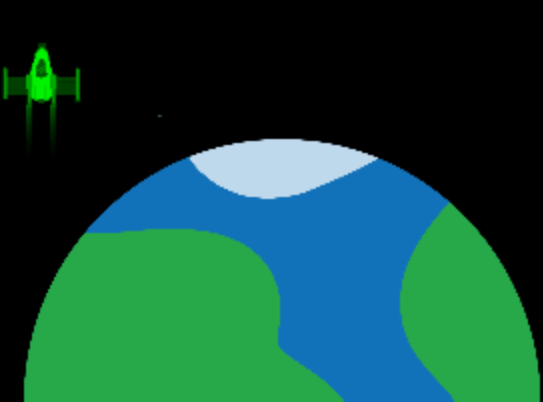

Als je afbeeldingen aan je project toevoegt, kun je `tint()` gebruiken om de kleur van de afbeelding te wijzigen.

Door een kleur aan te geven met `tint()` kun je de kleuren wijzigen van elke afbeelding die je daarna tekent. De afbeeldingen zien eruit alsof er een licht van de door jouw gekozen kleur op schijnt.

Met de `no_tint()` functie zet je de `tint()` functie uit als je klaar bent.

Dit voorbeeld voegt een groene `tint()` toe aan beide afbeeldingen.

--- code ---
---
language: python
---

  tint(0, 255, 0) # Groene tint image(raket, 50, 50, 100, 100) image(planeet, 50, 50, 300, 300)

--- /code ---

Dit voorbeeld voegt een groene `tint()` toe aan de eerste afbeelding en gebruikt vervolgens `no_tint()` voordat de tweede afbeelding wordt getekend.

--- code ---
---
language: python
---

  tint(0, 255, 0) # Groene tint image(raket, 50, 50, 100, 100) no_tint() # Verwijder tint image(planeet, 50, 50, 300, 300)

--- /code ---

